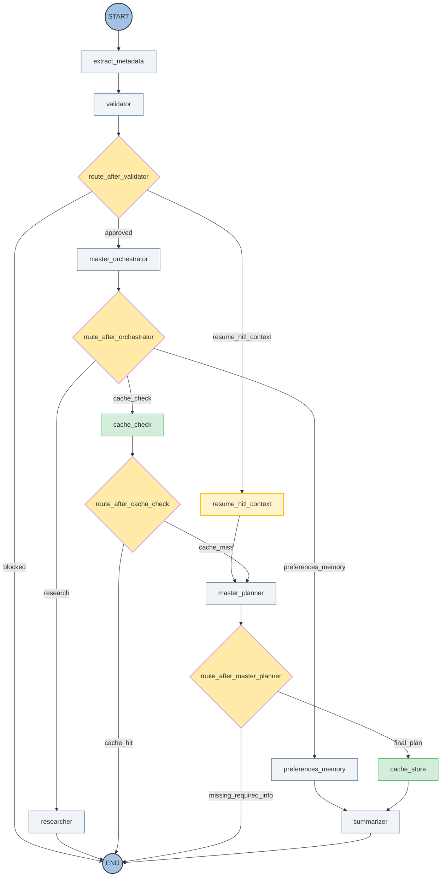
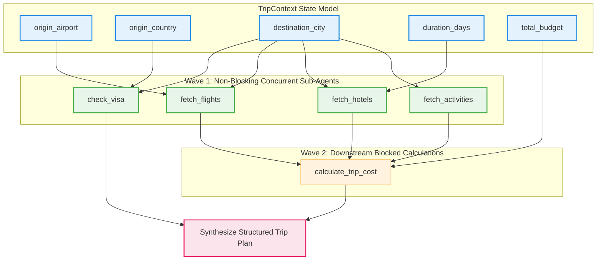

# Travel Agent System Architecture Diagrams

## 1. Complete System Architecture Workflow

```mermaid
graph TD
    classDef startEnd fill:#A2C2E8,stroke:#333,stroke-width:2px,rx:10px,ry:10px;
    classDef nodeStyle fill:#F0F4F8,stroke:#4A6B82,stroke-width:1px;
    classDef routerStyle fill:#FFEAA7,stroke:#D6A2E8,stroke-width:2px,shape:diamond;
    classDef cacheStyle fill:#D4EDDA,stroke:#28A745,stroke-width:1px;
    classDef hitlStyle fill:#FFF3CD,stroke:#FFC107,stroke-width:2px;

    START((START)):::startEnd
    EXTRACT_META[extract_metadata]:::nodeStyle
    VALIDATOR[validator]:::nodeStyle
    ROUTE_VAL{route_after_validator}:::routerStyle
    ROUTE_ORCH{route_after_orchestrator}:::routerStyle
    ROUTE_CACHE{route_after_cache_check}:::routerStyle
    ROUTE_PLAN{route_after_master_planner}:::routerStyle
    
    MASTER_ORCH[master_orchestrator]:::nodeStyle
    PREFS_MEM[preferences_memory]:::nodeStyle
    RESEARCHER[researcher]:::nodeStyle
    CACHE_CHECK[cache_check]:::cacheStyle
    RESUME_HITL[resume_hitl_context]:::hitlStyle
    MASTER_PLANNER[master_planner]:::nodeStyle
    CACHE_STORE[cache_store]:::cacheStyle
    SUMMARIZER[summarizer]:::nodeStyle
    END_NODE((END)):::startEnd

    START --> EXTRACT_META
    EXTRACT_META --> VALIDATOR
    VALIDATOR --> ROUTE_VAL
    
    ROUTE_VAL -- "blocked" --> END_NODE
    ROUTE_VAL -- "resume_hitl_context" --> RESUME_HITL
    ROUTE_VAL -- "approved" --> MASTER_ORCH
    
    RESUME_HITL --> MASTER_PLANNER
    MASTER_ORCH --> ROUTE_ORCH
    
    ROUTE_ORCH -- "preferences_memory" --> PREFS_MEM
    ROUTE_ORCH -- "research" --> RESEARCHER
    ROUTE_ORCH -- "cache_check" --> CACHE_CHECK
    
    PREFS_MEM --> SUMMARIZER
    RESEARCHER --> END_NODE
    
    CACHE_CHECK --> ROUTE_CACHE
    
    ROUTE_CACHE -- "cache_hit" --> END_NODE
    ROUTE_CACHE -- "cache_miss" --> MASTER_PLANNER
    
    MASTER_PLANNER --> ROUTE_PLAN
    
    ROUTE_PLAN -- "missing_required_info" --> END_NODE
    ROUTE_PLAN -- "final_plan" --> CACHE_STORE
    
    CACHE_STORE --> SUMMARIZER
    SUMMARIZER --> END_NODE
```

---

## 2. Async Task Dependency DAG (Master Planner Scheduling)

```mermaid
graph TD
    classDef contextStyle fill:#E3F2FD,stroke:#1E88E5,stroke-width:2px;
    classDef readyStyle fill:#E8F5E9,stroke:#4CAF50,stroke-width:2px;
    classDef blockedStyle fill:#FFF3E0,stroke:#FFB74D,stroke-width:1px;
    classDef finalStyle fill:#FCE4EC,stroke:#E91E63,stroke-width:2px;

    subgraph TripContext [TripContext State Model]
        ORIGIN_AIRPORT[origin_airport]:::contextStyle
        ORIGIN_COUNTRY[origin_country]:::contextStyle
        DEST_CITY[destination_city]:::contextStyle
        DURATION[duration_days]:::contextStyle
        BUDGET[total_budget]:::contextStyle
    end

    subgraph Wave1 [Wave 1: Non-Blocking Concurrent Sub-Agents]
        CHECK_VISA[check_visa]:::readyStyle
        FETCH_FLIGHTS[fetch_flights]:::readyStyle
        FETCH_HOTELS[fetch_hotels]:::readyStyle
        FETCH_ACTIVITIES[fetch_activities]:::readyStyle
    end

    subgraph Wave2 [Wave 2: Downstream Blocked Calculations]
        CALCULATE_TRIP_COST[calculate_trip_cost]:::blockedStyle
    end

    ORIGIN_COUNTRY & DEST_CITY --> CHECK_VISA
    ORIGIN_AIRPORT & DEST_CITY --> FETCH_FLIGHTS
    DEST_CITY & DURATION --> FETCH_HOTELS
    DEST_CITY --> FETCH_ACTIVITIES

    FETCH_FLIGHTS & FETCH_HOTELS & FETCH_ACTIVITIES & BUDGET --> CALCULATE_TRIP_COST

    FINAL_PLAN[Synthesize Structured Trip Plan]:::finalStyle
    CALCULATE_TRIP_COST & CHECK_VISA --> FINAL_PLAN
```