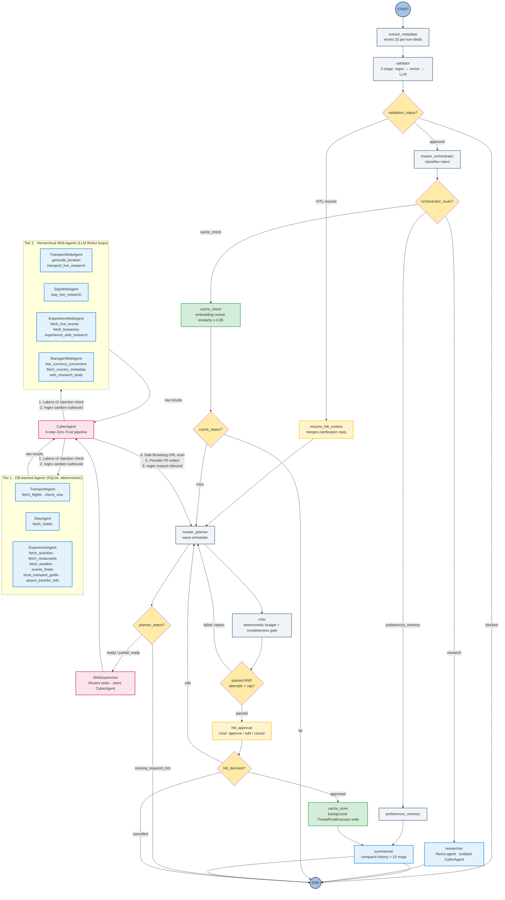

# Marco AI Travel Planner — Architectural Topology

> Visual and flow documentation for the Marco system.
> For code conventions and invariants, see CLAUDE.md. For setup, see README.md.

---

## 1. System Topology (LangGraph Architecture)

*Full routing pipeline showing safety guardrails, intent dispatch, and the WebSupervisor / CyberAgent Zero-Trust boundary managing both DB-backed and Web-backed autonomous agent teams.*



---

## 2. Async Task Dependency DAG (Master Planner Scheduling)

*Every tool is mapped to its owning agent. The CyberAgent boundary shows exactly where outbound sanitization and inbound inspection occur in the Wave 1 pipeline.*

```mermaid
graph TD
    classDef contextStyle  fill:#EDE7F6,stroke:#7B1FA2,stroke-width:1px
    classDef securityStyle fill:#FCE4EC,stroke:#E91E63,stroke-width:1px,stroke-dasharray:4
    classDef dbTool        fill:#E8F5E9,stroke:#4CAF50,stroke-width:2px
    classDef webTool       fill:#FCE4EC,stroke:#E91E63,stroke-width:2px
    classDef calcTask      fill:#FFF3E0,stroke:#FFB74D,stroke-width:2px

    subgraph TC ["TripContext Inputs"]
        OA[origin_airport]:::contextStyle
        OC[origin_country]:::contextStyle
        DC[destination_city]:::contextStyle
        DD[duration_days]:::contextStyle
        TB[total_budget]:::contextStyle
        TM[travel_month]:::contextStyle
    end

    subgraph SEC ["WebSupervisor · CyberAgent Security Boundary"]
        C_OUT["Sanitize Outbound\nStep 1 · Lakera Guard v2 async injection check\nStep 2 · regex strip always runs"]:::securityStyle
        C_IN["Inspect Inbound\nStep 4 · Google Safe Browsing URL scan\nStep 5 · Presidio PII redaction LOCAL asyncio.to_thread\nStep 6 · regex malicious-content scan always runs"]:::securityStyle
    end

    subgraph W1_DB ["Wave 1 · Tier 1 DB Agents  (asyncio.gather)"]
        subgraph TA ["TransportAgent  agent_name=transport_agent"]
            FF[fetch_flights\ndb_tools.fetch_flights]:::dbTool
            CV[check_visa\ndb_tools.get_visa_requirement]:::dbTool
        end
        subgraph SA ["StayAgent  agent_name=stay_agent"]
            FH[fetch_hotels\ndb_tools.fetch_hotels]:::dbTool
        end
        subgraph EA ["ExperienceAgent  agent_name=experience_agent"]
            FA[fetch_activities]:::dbTool
            FR[fetch_restaurants]:::dbTool
            FW[fetch_weather]:::dbTool
            EV[events_finder]:::dbTool
            LT[local_transport_guide]:::dbTool
            AT[airport_transfer_info]:::dbTool
        end
    end

    subgraph W1_WEB ["Wave 1 · Tier 2 Hierarchical Web Agents  (asyncio.gather)"]
        subgraph TWA ["TransportWebAgent  agent_name=transport_web_agent  ReAct loop"]
            GL[geocode_location\nOpenCage API]:::webTool
            TLR[transport_live_research\ntavily_transport_search]:::webTool
        end
        subgraph SWA ["StayWebAgent  agent_name=stay_web_agent  ReAct loop"]
            SLR[stay_live_research\ntavily_reviews_search]:::webTool
        end
        subgraph EWA ["ExperienceWebAgent  agent_name=experience_web_agent  ReAct loop"]
            LE[fetch_live_events\nTicketmaster API]:::webTool
            FB[fetch_breweries\nOpen Brewery DB]:::webTool
            EWR[experience_web_research]:::webTool
        end
        subgraph MWA ["ManagerWebAgent  agent_name=manager_web_agent  direct async"]
            LC[live_currency_conversion\nExchangeRate-API]:::webTool
            CM[fetch_country_metadata\nRestCountries API]:::webTool
            WT[web_research_tavily\ntavily_general_research]:::webTool
        end
    end

    subgraph W2 ["Wave 2 · Dependent Calculations  (after flights + hotels complete)"]
        CTC[calculate_trip_cost\ncalc_tools]:::calcTask
    end

    TC --> C_OUT

    C_OUT --> W1_DB
    C_OUT --> W1_WEB

    OA & DC --> FF
    OC & DC --> CV
    DC & DD --> FH
    DC --> FA & FR & LT & AT
    DC & TM --> FW & EV

    DC --> GL & TLR & SLR & FB & EWR & CM & WT
    DC & TM --> LE
    OC --> LC

    W1_DB  --> C_IN
    W1_WEB --> C_IN

    C_IN --> W2
    FF & FH & FA & TB --> CTC
```



---

## 3. WebSupervisor · CyberAgent 6-Step Zero-Trust Pipeline

```
OUTBOUND ──► Step 1 │ Async Lakera Guard v2 injection check (per TripContext field)
                    │   Hard-blocks dispatch if flagged.
                    │   Fallback: compiled regex (always available, no key needed).
                    │
             Step 2 │ Synchronous regex sanitization — always runs.
                    │   Strips residual injection phrases even after Step 1 clears.
                    │
DISPATCH ──► Step 3 │ asyncio.gather — all 7 sub-agents run in parallel.
                    │   (3 DB agents + 4 Web agents)
                    │
INBOUND  ──► Step 4 │ Google Safe Browsing v4 URL scan.
                    │   Replaces malicious links with [BLOCKED MALICIOUS URL].
                    │   Fail-open: empty list returned when key absent (no false blocks).
                    │
             Step 5 │ Microsoft Presidio PII redaction — fully LOCAL, no API key.
                    │   Runs via asyncio.to_thread (non-blocking).
                    │   Requires: python -m spacy download en_core_web_sm
                    │   Redacts: PERSON, EMAIL, PHONE, CREDIT_CARD, LOCATION, ORG, etc.
                    │   Note: also redacts named entities such as airline names.
                    │   Passthrough when spaCy model not installed.
                    │
             Step 6 │ Regex malicious-content scan — always runs.
                    │   Redacts: <script>, eval(), os.system(), DROP TABLE, etc.
                    │
            Return Dict[str, str] to master_planner
```

---

## 4. Wave Scheduling Breakdown

| Wave | Trigger | Executed By | Agents / Tasks |
|---|---|---|---|
| **Wave 1** | All required `TripContext` fields present | `WebSupervisor.dispatch()` → `asyncio.gather` | All 7 sub-agents in parallel: `TransportAgent`, `StayAgent`, `ExperienceAgent`, `TransportWebAgent`, `StayWebAgent`, `ExperienceWebAgent`, `ManagerWebAgent` |
| **Wave 2** | `fetch_flights` + `fetch_hotels` + `fetch_activities` completed | `asyncio.gather` (single task) | `calculate_trip_cost` via `calc_tools` |
| **Web fallback** | Any DB section returned empty after Wave 1 | `fill_missing_with_web()` in `plan_enricher.py` | Targeted Tavily searches per empty section |
| **Replanning (cached)** | `force_replan=True` + previous `trip_context` present | `analyze_replanning()` then `WebSupervisor.dispatch(allowed_tasks=...)` | Only invalidated tasks re-run; preserved results merged immediately |

---

## 5. Replanner Task Invalidation Matrix (`diff_changed_tasks`)

When a user edits a trip parameter, `diff_changed_tasks` computes the exact intersection of Tier 1 (DB) and Tier 2 (Web) tasks that must be re-run, preserving all others.

| Changed Field | Invalidated — re-run | Preserved — reused from cache |
|---|---|---|
| `origin_airport` | `fetch_flights`, `check_visa`, `calculate_trip_cost` *(cascade)*, **`transport_live_research`** *(Tier 2 web key)* | `fetch_hotels`, `fetch_activities`, `fetch_restaurants`, `fetch_weather`, `events_finder`, `local_transport_guide`, `airport_transfer_info`, `stay_live_research`, `experience_web_research`, all Manager keys |
| `total_budget` | `calculate_trip_cost`, `live_currency_conversion` | `fetch_flights`, `fetch_hotels`, all experience tools, all web research keys |
| `destination_city` | **Full replan** — every `PlannerTaskType` value + `transport_live_research`, `stay_live_research`, `experience_web_research` | — |
| No change | ∅ (empty) | Everything |

> `transport_live_research`, `stay_live_research`, and `experience_web_research` are free-form Tier 2 result keys — not `PlannerTaskType` enum members. They are tracked explicitly via `_WEB_AGENT_EXTRA_KEYS` in `planner_dependencies.py`.

---

## 6. Semantic Cache Decision Flow

```
User message
    │
    ▼
extract_trip_context_deterministic()
    │  Cache key: {destination_city, duration_days, total_budget,
    │              origin_airport, origin_country, num_travelers, currency}
    ▼
force_replan = True? ──YES──► cache_status = "miss"  (always bypass)
    │ NO
    ▼
find_cached_answer(threshold=0.85)
    │
    ├─ Layer 1: SQLite pre-filter  — destination exact match + budget ±5%
    ├─ Layer 2: Python hard filter — duration bucket
    └─ Layer 3: Cosine similarity  — best match score vs threshold
                    │
                  ≥ 0.85? ──YES──► HIT  → AIMessage served instantly → END
                    │ NO
                    ▼
                  MISS → master_planner → … → critic → hitl_approval
                                                            │ approved
                                                            ▼
                                                    cache_store_node
                                                        └─ _executor.submit()
                                                              │ (background thread)
                                                              ▼
                                                    compress_answer()
                                                    store_cache_entry()  → SQLite
                                                    (returns to user immediately ↑)
```

> **Threshold is inclusive at 0.85.** Score `0.85` = HIT. Score `0.84` = MISS.
> `run_cache_store` guards on `state["trip_context"]["destination_city"]` — plans for
> unsupported or unknown destinations are never written to the cache.
