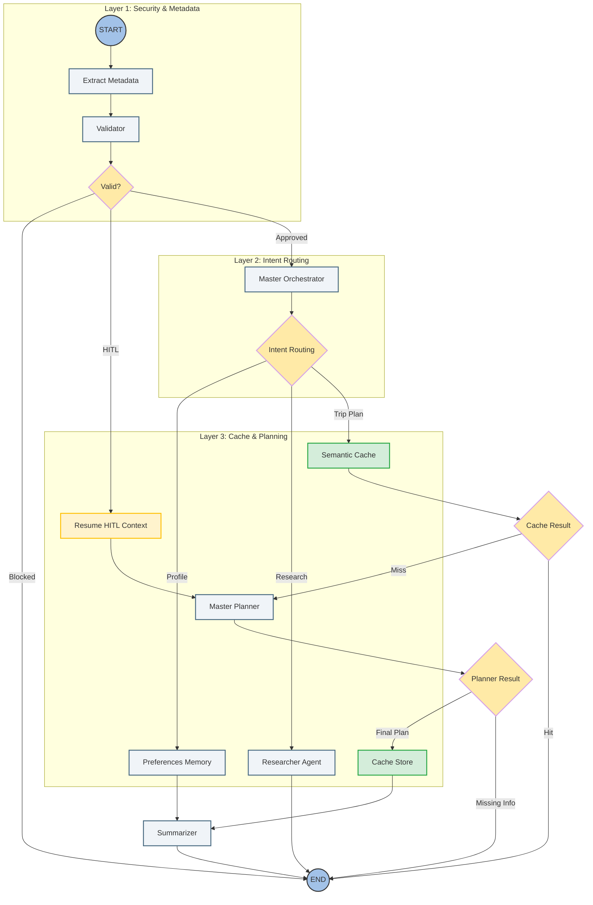

# Travel Agent Ecosystem: Technical Architecture & Execution Matrix

## 1. System Topology (LangGraph Architecture)
*This graph illustrates the high-level routing, safety guardrails, and intent dispatch logic.*



---

## 2. Async Task Dependency DAG (Master Planner Scheduling)

```mermaid
graph TD
    %% Styling Configuration
    classDef agentStyle fill:#E3F2FD,stroke:#1E88E5,stroke-width:2px,rx:8px,ry:8px;
    classDef toolStyle fill:#FFF3E0,stroke:#FFB74D,stroke-width:1px,shape:rect;
    classDef readyStyle fill:#E8F5E9,stroke:#4CAF50,stroke-width:2px;
    classDef blockedStyle fill:#FFF3E0,stroke:#FFB74D,stroke-width:1px;

    %% Data Inputs
    subgraph TripContext [TripContext State Model]
        ORIGIN_AIRPORT[origin_airport]:::contextStyle
        ORIGIN_COUNTRY[origin_country]:::contextStyle
        DEST_CITY[destination_city]:::contextStyle
        DURATION[duration_days]:::contextStyle
        BUDGET[total_budget]:::contextStyle
    end

    %% Execution Waves
    subgraph Wave1 [Wave 1: Async Concurrent Sub-Agents]
        CHECK_VISA[check_visa]:::readyStyle
        FETCH_FLIGHTS[fetch_flights]:::readyStyle
        FETCH_HOTELS[fetch_hotels]:::readyStyle
        FETCH_ACTIVITIES[fetch_activities]:::readyStyle
    end

    subgraph Wave2 [Wave 2: Downstream Blocked Calculations]
        CALCULATE_TRIP_COST[calculate_trip_cost]:::blockedStyle
    end

    %% Pathing
    ORIGIN_COUNTRY & DEST_CITY --> CHECK_VISA
    ORIGIN_AIRPORT & DEST_CITY --> FETCH_FLIGHTS
    DEST_CITY & DURATION --> FETCH_HOTELS
    DEST_CITY --> FETCH_ACTIVITIES

    FETCH_FLIGHTS & FETCH_HOTELS & FETCH_ACTIVITIES & BUDGET --> CALCULATE_TRIP_COST

    FINAL_PLAN[Synthesize Structured Trip Plan]:::finalStyle
    CALCULATE_TRIP_COST & CHECK_VISA --> FINAL_PLAN
    ```