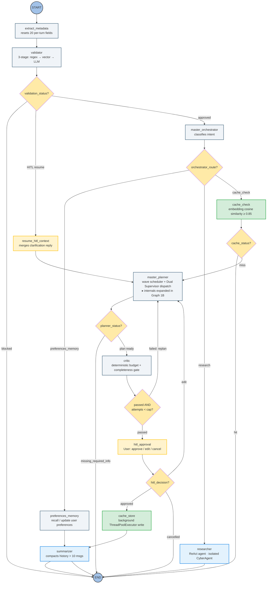
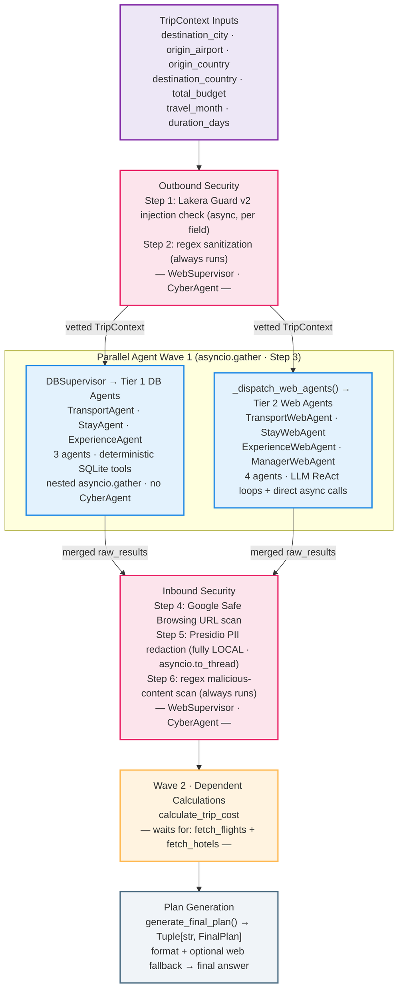

# Marco AI Travel Planner — Architectural Topology

> Visual and flow documentation for the Marco system.
> For code conventions and invariants, see CLAUDE.md. For setup, see README.md.

---

## 1A. System Topology — High-Level Abstract View

*End-to-end LangGraph routing pipeline from `START` to `END`. The `master_planner` is treated here as a single opaque block — its internal WebSupervisor dispatch, CyberAgent Zero-Trust pipeline, DBSupervisor, and all seven sub-agents are deliberately hidden and expanded in Graph 1B below. Every user message passes through `validator` unconditionally before reaching any downstream node.*



---

## 1B. System Topology — Micro View (Inside `master_planner`)

*Zooms into the `master_planner` dispatch cycle. `WebSupervisor` enforces the 6-step Zero-Trust pipeline through `CyberAgent`. Steps 1–2 are outbound sanitisation before dispatch; Step 3 fans out via `asyncio.gather` to two concurrent branches: `DBSupervisor` (which runs the three Tier 1 DB agents in a nested parallel gather) and `_dispatch_web_agents()` (which runs the four Tier 2 web agents in a nested parallel gather); Steps 4–6 are inbound inspection on the merged results from both branches. A single injection-flagged TripContext field in Step 1 hard-blocks the entire dispatch and returns a `security_alert` without running any sub-agent. `DBSupervisor` has no `CyberAgent` — it receives the vetted `TripContext` from Step 2 and operates entirely inside this Zero-Trust perimeter.*

```mermaid
graph TD
    classDef plannerNode    fill:#F0F4F8,stroke:#4A6B82,stroke-width:2px,font-weight:bold
    classDef supervisorNode fill:#FCE4EC,stroke:#E91E63,stroke-width:2px,font-weight:bold
    classDef dbsNode        fill:#F3E5F5,stroke:#9C27B0,stroke-width:2px,font-weight:bold
    classDef secStep        fill:#FCEAEA,stroke:#E91E63,stroke-width:1px,stroke-dasharray:4
    classDef blockNode      fill:#FFCDD2,stroke:#B71C1C,stroke-width:2px
    classDef tier1Node      fill:#E8F5E9,stroke:#4CAF50,stroke-width:2px
    classDef tier2Node      fill:#E3F2FD,stroke:#1E88E5,stroke-width:2px
    classDef mergeNode      fill:#FFF9C4,stroke:#F9A825,stroke-width:2px

    MP_IN(["master_planner\ntriggers WebSupervisor dispatch"]):::plannerNode
    WS["WebSupervisor\nsecurity-aware coordinator · owns CyberAgent"]:::supervisorNode

    STEP1["Step 1 — Outbound: Lakera Guard v2\nasync injection check per TripContext field\n(destination_city · destination_country\n origin_country · origin_airport)\nHard-blocks dispatch if any field is flagged\nFallback: compiled regex when LAKERA_API_KEY absent"]:::secStep

    BLOCK(["BLOCKED\nsecurity_alert returned\ndispatch aborted"]):::blockNode

    STEP2["Step 2 — Outbound: Regex sanitization\nalways runs — strips residual injection phrases\nproduces sanitized TripContext copy via model_copy()"]:::secStep

    DBS["DBSupervisor\nTier 1 parallel dispatcher · nested asyncio.gather\nno CyberAgent — receives vetted TripContext from Step 2\noperates inside this Zero-Trust perimeter"]:::dbsNode

    WD["_dispatch_web_agents()\nTier 2 parallel dispatcher · nested asyncio.gather\nrecord_outcome per agent via CyberAgent ref"]:::dbsNode

    subgraph TIER1 ["Tier 1 · DB-backed Agents  (asyncio.gather — via DBSupervisor)"]
        T_AGT["TransportAgent\nfetch_flights · check_visa"]:::tier1Node
        S_AGT["StayAgent\nfetch_hotels"]:::tier1Node
        E_AGT["ExperienceAgent\nfetch_activities · fetch_restaurants\nfetch_weather · events_finder\nlocal_transport_guide · airport_transfer_info"]:::tier1Node
    end

    subgraph TIER2 ["Tier 2 · Hierarchical Web Agents  (asyncio.gather — via _dispatch_web_agents)"]
        TW_AGT["TransportWebAgent\ngeocode_location · transport_live_research\nOpenCage geocoding · Tavily transport search"]:::tier2Node
        SW_AGT["StayWebAgent\nstay_live_research\nTavily reviews search"]:::tier2Node
        EW_AGT["ExperienceWebAgent\nfetch_live_events · fetch_breweries\nexperience_web_research\nTicketmaster API · Open Brewery DB"]:::tier2Node
        MW_AGT["ManagerWebAgent\nlive_currency_conversion · fetch_country_metadata\nweb_research_tavily\ndirect async calls — no LLM loop"]:::tier2Node
    end

    MERGE["Merge raw_results\ncombined Dict[str, str] from both tiers + existing_results\n(failed agents do not block others; failing tier does not block the other)"]:::mergeNode

    STEP4["Step 4 — Inbound: Google Safe Browsing v4\nURL scan — malicious links → [BLOCKED MALICIOUS URL]\nfail-open when GOOGLE_SAFE_BROWSING_KEY absent"]:::secStep

    STEP5["Step 5 — Inbound: Microsoft Presidio PII redaction\nfully LOCAL · asyncio.to_thread · no API key required\nPERSON · EMAIL · PHONE_NUMBER · CREDIT_CARD · LOCATION · ORG\npassthrough when spaCy model not installed"]:::secStep

    STEP6["Step 6 — Inbound: Regex malicious-content scan\nalways runs — script · eval · exec · DROP TABLE → [redacted]"]:::secStep

    MP_OUT(["Return Dict[str, str]\nto master_planner"]):::plannerNode

    MP_IN --> WS --> STEP1
    STEP1 -- "injection flagged" --> BLOCK
    STEP1 -- "clear" --> STEP2
    STEP2 -- "Step 3: asyncio.gather" --> DBS & WD
    DBS --> TIER1
    WD --> TIER2
    TIER1 & TIER2 -- "new results" --> MERGE
    MERGE --> STEP4 --> STEP5 --> STEP6 --> MP_OUT
```



---

## 2A. Async Task Dependency DAG — High-Level Abstract Flow

*Conceptual view of how TripContext inputs flow through the security boundary and parallel agent waves before producing the final dependent calculations. Individual tools and TripContext fields are intentionally omitted at this level of abstraction; see Graph 2B for the full breakdown.*



---

## 2B. Async Task Dependency DAG — Detailed DAG (Micro View)

*Full drill-down. Every TripContext field is mapped to the exact tools it unblocks, based on `_TASK_REQUIREMENTS` in `planner_dependencies.py`. Three result keys — `transport_live_research`, `stay_live_research`, and `experience_web_research` — are **not** `PlannerTaskType` enum members; they are free-form strings produced by Tier 2 agents and tracked via `_WEB_AGENT_EXTRA_KEYS`. The `calculate_trip_cost` node (Wave 2) has two explicit `PlannerDependency` edges (`fetch_flights`, `fetch_hotels`) plus a `duration_days` context requirement. `DBSupervisor` sits between the outbound security boundary and the Tier 1 agents — it has no CyberAgent of its own.*

> **Colour key:** green = SQLite DB tool (`dbTool`) · red/pink = live web API tool (`webTool`) · indigo dashed = free-form web result key, not a `PlannerTaskType` enum member (`freeWebKey`) · orange = Wave 2 calculation · purple = TripContext input field · red dashed = CyberAgent security boundary · violet = DBSupervisor dispatcher

```mermaid
graph TD
    classDef contextStyle  fill:#EDE7F6,stroke:#7B1FA2,stroke-width:1px
    classDef securityStyle fill:#FCE4EC,stroke:#E91E63,stroke-width:1px,stroke-dasharray:4
    classDef dbsStyle      fill:#F3E5F5,stroke:#9C27B0,stroke-width:2px
    classDef dbTool        fill:#E8F5E9,stroke:#4CAF50,stroke-width:2px
    classDef webTool       fill:#FCE4EC,stroke:#E91E63,stroke-width:2px
    classDef freeWebKey    fill:#E8EAF6,stroke:#3F51B5,stroke-width:2px,stroke-dasharray:3
    classDef calcTask      fill:#FFF3E0,stroke:#FFB74D,stroke-width:2px

    subgraph TC ["TripContext Inputs"]
        OA[origin_airport]:::contextStyle
        OC[origin_country]:::contextStyle
        DC[destination_city]:::contextStyle
        DCO[destination_country]:::contextStyle
        DD[duration_days]:::contextStyle
        TB[total_budget]:::contextStyle
        TM[travel_month]:::contextStyle
    end

    subgraph SEC ["WebSupervisor · CyberAgent Security Boundary"]
        C_OUT["Sanitize Outbound\nStep 1 · Lakera Guard v2 async injection check\nStep 2 · regex strip — always runs"]:::securityStyle
        DBS_STEP["DBSupervisor\nnested asyncio.gather · no CyberAgent\nreceives vetted TripContext from Step 2"]:::dbsStyle
        C_IN["Inspect Inbound\nStep 4 · Google Safe Browsing URL scan\nStep 5 · Presidio PII redaction LOCAL asyncio.to_thread\nStep 6 · regex malicious-content scan — always runs"]:::securityStyle
    end

    subgraph W1_DB ["Wave 1 · Tier 1 DB Agents  (via DBSupervisor · asyncio.gather)"]
        subgraph TA ["TransportAgent  agent_name=transport_agent"]
            FF[fetch_flights\ndb_tools.fetch_flights]:::dbTool
            CV[check_visa\ndb_tools.get_visa_requirement]:::dbTool
        end
        subgraph SA ["StayAgent  agent_name=stay_agent"]
            FH[fetch_hotels\ndb_tools.fetch_hotels]:::dbTool
        end
        subgraph EA ["ExperienceAgent  agent_name=experience_agent"]
            FA[fetch_activities]:::dbTool
            FR[fetch_restaurants]:::dbTool
            FW[fetch_weather]:::dbTool
            EV[events_finder]:::dbTool
            LT[local_transport_guide]:::dbTool
            AT[airport_transfer_info]:::dbTool
        end
    end

    subgraph W1_WEB ["Wave 1 · Tier 2 Hierarchical Web Agents  (via _dispatch_web_agents · asyncio.gather)"]
        subgraph TWA ["TransportWebAgent  agent_name=transport_web_agent  ReAct loop"]
            GL[geocode_location\nOpenCage API]:::webTool
            TLR["transport_live_research\ntavily_transport_search\nfree-form key"]:::freeWebKey
        end
        subgraph SWA ["StayWebAgent  agent_name=stay_web_agent  ReAct loop"]
            SLR["stay_live_research\ntavily_reviews_search\nfree-form key"]:::freeWebKey
        end
        subgraph EWA ["ExperienceWebAgent  agent_name=experience_web_agent  ReAct loop"]
            LE[fetch_live_events\nTicketmaster API]:::webTool
            FB[fetch_breweries\nOpen Brewery DB]:::webTool
            EWR["experience_web_research\nfree-form key"]:::freeWebKey
        end
        subgraph MWA ["ManagerWebAgent  agent_name=manager_web_agent  direct async"]
            LC[live_currency_conversion\nExchangeRate-API]:::webTool
            CM[fetch_country_metadata\nRestCountries API]:::webTool
            WT[web_research_tavily\nTavily general research]:::webTool
        end
    end

    subgraph W2 ["Wave 2 · Dependent Calculations  (after flights + hotels complete)"]
        CTC[calculate_trip_cost\ncalc_tools]:::calcTask
    end

    TC --> C_OUT

    C_OUT --> DBS_STEP
    DBS_STEP --> W1_DB
    C_OUT --> W1_WEB

    OA & DC --> FF
    OC & DCO --> CV
    DC --> FH
    DC --> FA & FR & LT & AT
    DC & TM --> FW & EV

    DC --> GL & TLR & SLR & FB & EWR & CM & WT
    DC --> LE
    DC & TB & OC --> LC

    W1_DB  --> C_IN
    W1_WEB --> C_IN

    C_IN --> W2
    FF & FH & DD & TB --> CTC
```



---

## 3. WebSupervisor · CyberAgent 6-Step Zero-Trust Pipeline

```
OUTBOUND ──► Step 1 │ Async Lakera Guard v2 injection check (per TripContext field)
                    │   Hard-blocks dispatch if flagged.
                    │   Fallback: compiled regex (always available, no key needed).
                    │
             Step 2 │ Synchronous regex sanitization — always runs.
                    │   Strips residual injection phrases even after Step 1 clears.
                    │
DISPATCH ──► Step 3 │ Concurrent dual dispatch via asyncio.gather — two parallel branches:
                    │   Branch A: DBSupervisor.dispatch()
                    │     → nested asyncio.gather(TransportAgent, StayAgent, ExperienceAgent)
                    │     DBSupervisor has no CyberAgent; receives vetted TripContext from Step 2;
                    │     operates inside this Zero-Trust perimeter.
                    │   Branch B: _dispatch_web_agents()
                    │     → nested asyncio.gather(TransportWebAgent, StayWebAgent,
                    │                              ExperienceWebAgent, ManagerWebAgent)
                    │   A failing agent does not block others;
                    │   a failing tier does not block the other tier.
                    │
INBOUND  ──► Step 4 │ Google Safe Browsing v4 URL scan.
                    │   Replaces malicious links with [BLOCKED MALICIOUS URL].
                    │   Fail-open: empty list returned when key absent (no false blocks).
                    │
             Step 5 │ Microsoft Presidio PII redaction — fully LOCAL, no API key.
                    │   Runs via asyncio.to_thread (non-blocking).
                    │   Requires: python -m spacy download en_core_web_sm
                    │   Redacts: PERSON, EMAIL, PHONE, CREDIT_CARD, LOCATION, ORG, etc.
                    │   Note: also redacts named entities such as airline names.
                    │   Passthrough when spaCy model not installed.
                    │
             Step 6 │ Regex malicious-content scan — always runs.
                    │   Redacts: <script>, eval(), os.system(), DROP TABLE, etc.
                    │
            Return Dict[str, str] to master_planner
```

---

## 4. Wave Scheduling Breakdown

| Wave | Trigger | Executed By | Agents / Tasks |
|---|---|---|---|
| **Wave 1** | All required `TripContext` fields present | `WebSupervisor.dispatch()` → concurrent dual dispatch: `DBSupervisor` (Tier 1, nested `asyncio.gather`) **and** `_dispatch_web_agents()` (Tier 2, nested `asyncio.gather`) | All 7 sub-agents in parallel: `TransportAgent`, `StayAgent`, `ExperienceAgent` (via `DBSupervisor`) · `TransportWebAgent`, `StayWebAgent`, `ExperienceWebAgent`, `ManagerWebAgent` (via `_dispatch_web_agents`) |
| **Wave 2** | `fetch_flights` + `fetch_hotels` + `fetch_activities` completed | `asyncio.gather` (single task) | `calculate_trip_cost` via `calc_tools` |
| **Web fallback** | Any DB section returned empty after Wave 1 | `fill_missing_with_web()` in `plan_enricher.py` | Targeted Tavily searches per empty section |
| **Replanning (cached)** | `force_replan=True` + previous `trip_context` present | `analyze_replanning()` then `WebSupervisor.dispatch(allowed_tasks=...)` | Only invalidated tasks re-run; each tier's registry call filters independently; preserved results merged immediately |

---

## 5. Replanner Task Invalidation Matrix (`diff_changed_tasks`)

When a user edits a trip parameter, `diff_changed_tasks` computes the exact intersection of Tier 1 (DB) and Tier 2 (Web) tasks that must be re-run, preserving all others.

| Changed Field | Invalidated — re-run | Preserved — reused from cache |
|---|---|---|
| `origin_airport` | `fetch_flights`, `check_visa`, `calculate_trip_cost` *(cascade)*, **`transport_live_research`** *(Tier 2 web key)* | `fetch_hotels`, `fetch_activities`, `fetch_restaurants`, `fetch_weather`, `events_finder`, `local_transport_guide`, `airport_transfer_info`, `stay_live_research`, `experience_web_research`, all Manager keys |
| `total_budget` | `calculate_trip_cost`, `live_currency_conversion` | `fetch_flights`, `fetch_hotels`, all experience tools, all web research keys |
| `destination_city` | **Full replan** — every `PlannerTaskType` value + `transport_live_research`, `stay_live_research`, `experience_web_research` | — |
| No change | ∅ (empty) | Everything |

> `transport_live_research`, `stay_live_research`, and `experience_web_research` are free-form Tier 2 result keys — not `PlannerTaskType` enum members. They are tracked explicitly via `_WEB_AGENT_EXTRA_KEYS` in `planner_dependencies.py`.
>
> `WebSupervisor.dispatch(allowed_tasks=...)` passes the same set to both `DBSupervisor` and `_dispatch_web_agents()`. Each tier's registry call (`get_db_agents_for_tasks` / `get_web_agents_for_tasks`) independently filters to agents that cover at least one invalidated task — no explicit per-tier splitting is required in the planner.

---

## 6. Semantic Cache Decision Flow

```
User message
    │
    ▼
extract_trip_context_deterministic()
    │  Cache key: {destination_city, duration_days, total_budget,
    │              origin_airport, origin_country, num_travelers, currency}
    ▼
force_replan = True? ──YES──► cache_status = "miss"  (always bypass)
    │ NO
    ▼
find_cached_answer(threshold=0.85)
    │
    ├─ Layer 1: SQLite pre-filter  — destination exact match + budget ±5%
    ├─ Layer 2: Python hard filter — duration bucket
    └─ Layer 3: Cosine similarity  — best match score vs threshold
                    │
                  ≥ 0.85? ──YES──► HIT  → AIMessage served instantly → END
                    │ NO
                    ▼
                  MISS → master_planner → … → critic → hitl_approval
                                                            │ approved
                                                            ▼
                                                    cache_store_node
                                                        └─ _executor.submit()
                                                              │ (background thread)
                                                              ▼
                                                    compress_answer()
                                                    store_cache_entry()  → SQLite
                                                    (returns to user immediately ↑)
```

> **Threshold is inclusive at 0.85.** Score `0.85` = HIT. Score `0.84` = MISS.
> `run_cache_store` guards on `state["trip_context"]["destination_city"]` — plans for
> unsupported or unknown destinations are never written to the cache.
