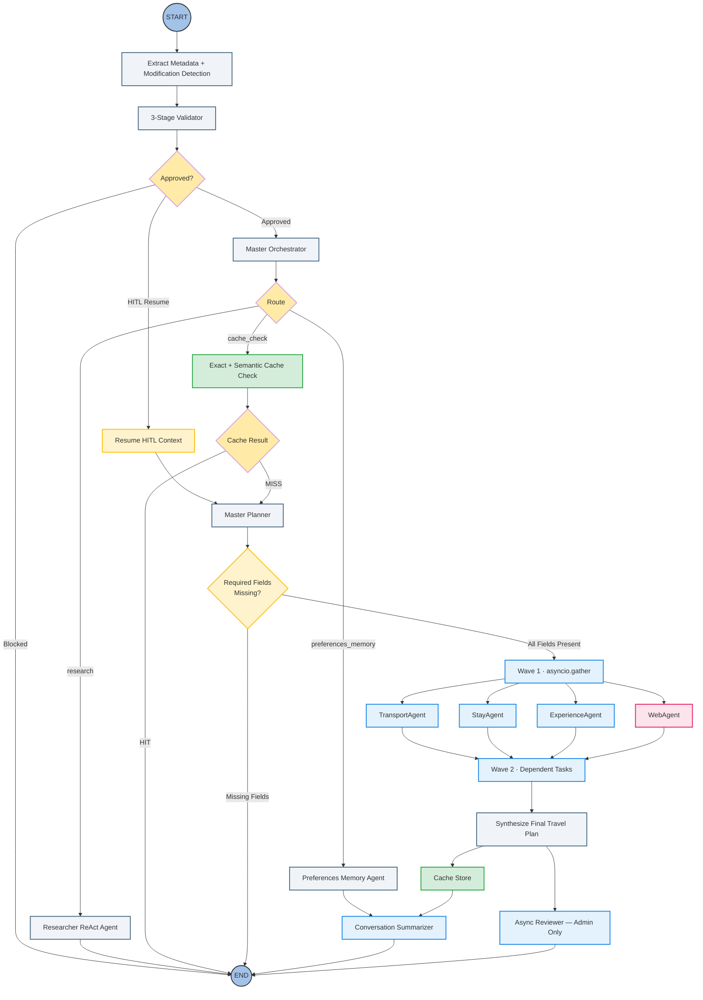

# Travel Agent Ecosystem: Technical Architecture & Execution Matrix

## 1. System Topology (LangGraph Architecture)
*This graph maps the full routing pipeline — safety guardrails, intent dispatch, HITL checkpoint, and the four-sub-agent async planning core.*



---

## 2. Async Task Dependency DAG (Master Planner Scheduling)
*Wave 1 tasks execute concurrently via `asyncio.gather`. Wave 2 tasks execute only after their declared input dependencies have resolved.*

```mermaid
graph TD
    classDef contextStyle fill:#EDE7F6,stroke:#7B1FA2,stroke-width:1px;
    classDef sqliteTask fill:#E8F5E9,stroke:#4CAF50,stroke-width:2px;
    classDef webTask fill:#FCE4EC,stroke:#E91E63,stroke-width:2px;
    classDef calcTask fill:#FFF3E0,stroke:#FFB74D,stroke-width:2px;
    classDef finalStyle fill:#E3F2FD,stroke:#1E88E5,stroke-width:2px;

    subgraph TC [TripContext Inputs]
        OA[origin_airport]:::contextStyle
        OC[origin_country]:::contextStyle
        DC[destination_city]:::contextStyle
        DD[duration_days]:::contextStyle
        TB[total_budget]:::contextStyle
        TM[travel_month]:::contextStyle
    end

    subgraph W1S [Wave 1 · SQLite Sub-Agents]
        FF[fetch_flights]:::sqliteTask
        CV[check_visa]:::sqliteTask
        FH[fetch_hotels]:::sqliteTask
        FA[fetch_activities]:::sqliteTask
        FR[fetch_restaurants]:::sqliteTask
        FW[fetch_weather]:::sqliteTask
        EF[events_finder]:::sqliteTask
        LT[local_transport_guide]:::sqliteTask
        AT[airport_transfer_info]:::sqliteTask
    end

    subgraph W1W [Wave 1 · WebAgent]
        GL[geocode_location]:::webTask
        LE[fetch_live_events]:::webTask
        LC[live_currency_conversion]:::webTask
        FB[fetch_breweries]:::webTask
        CM[fetch_country_metadata]:::webTask
        WT[web_research_tavily]:::webTask
    end

    subgraph W2 [Wave 2 · Dependent Calculations]
        CTC[calculate_trip_cost]:::calcTask
    end

    OA & DC --> FF
    OC & DC --> CV
    DC & DD --> FH
    DC --> FA
    DC --> FR
    DC & TM --> FW
    DC & TM --> EF
    DC --> LT
    DC --> AT

    DC --> GL
    DC & TM --> LE
    OC --> LC
    DC --> FB
    DC --> CM
    DC --> WT

    FF & FH & FA & TB --> CTC

    SYNTH[Synthesize Structured Trip Plan]:::finalStyle
    CTC & CV & GL & CM & LC --> SYNTH
```



---

## 3. AgentState Schema Layout

*`AgentState` is the single shared ledger threaded through every graph node via LangGraph's `StateGraph`. Nodes read only the fields they require and write only the fields they own. All fields are optional at runtime.*

| Field | Type | Written By | Purpose |
|---|---|---|---|
| `messages` | `Annotated[list, add_messages]` | All nodes | Full conversation history |
| `current_city` | `str` | `extract_metadata` | Destination detected in latest message |
| `total_budget` | `float` | `extract_metadata` | Budget detected in latest message |
| `tool_call_count` | `int` | `extract_metadata`, `agent` | Incremented per tool call; circuit breaker reads it |
| `force_replan` | `bool` | `extract_metadata` | Bypasses cache hit when trip parameters are modified |
| `validation_status` | `str` | `validator` | `"approved"` or a `BLOCKED_*` verdict |
| `orchestrator_route` | `str` | `master_orchestrator` | `"preferences_memory"` · `"research"` · `"cache_check"` |
| `orchestrator_reason` | `str` | `master_orchestrator` | Short explanation for the chosen route |
| `preferred_airline` | `str` | `preferences_memory` | Persisted across sessions via `SqliteSaver` |
| `food_preference` | `str` | `preferences_memory` | Persisted |
| `num_travelers` | `int` | `preferences_memory` | Persisted |
| `travel_preferences` | `str` | `preferences_memory` | Free-form persisted preferences |
| `is_admin` | `bool` | `main.py` | Session ID ending `ADMIN00` enables plan reviewer |
| `conversation_summary` | `str` | `summarizer` | Compact past-context injected when history > 10 messages |
| `cache_status` | `str` | `cache_checker` | `"hit"` · `"miss"` |
| `cache_similarity_score` | `float` | `cache_checker` | Best cosine similarity score found |
| `cache_matched_query` | `str` | `cache_checker` | Matched cache key |
| `cache_answer` | `str` | `cache_checker` | Cached plan text on a hit |
| `trip_context` | `dict` | `master_planner`, `resume_hitl_context` | Serialized `TripContext` |
| `context_enrichment_status` | `str` | `master_planner` | `"completed"` · `"failed"` |
| `planner_status` | `str` | `master_planner` | `"ready"` · `"partial_ready"` · `"missing_required_info"` |
| `planner_task_results` | `dict` | `master_planner` | Raw string results keyed by task type value |
| `planner_structured_results` | `dict` | `master_planner` | Typed `PlannerToolResults` (flights, hotels, etc.) |
| `planner_dependency_graph` | `dict` | `master_planner` | Serialized `PlannerDependencyGraph` |
| `planner_scheduler_result` | `dict` | `master_planner` | Serialized `SchedulerResult` with execution waves |
| `planning_mode` | `str` | `master_planner` | `"full_planning"` · `"replanning"` |
| `awaiting_user_clarification` | `bool` | `master_planner` | `True` when planner is paused for HITL |
| `pending_trip_context` | `dict` | `master_planner` | Partial `TripContext` saved at HITL pause |
| `pending_missing_fields` | `List[str]` | `master_planner` | Required fields still absent at HITL pause |
| `pending_hitl_question` | `str` | `master_planner` | Clarification question shown to the user |
| `pending_planner_task_results` | `dict` | `master_planner` | Task results collected before the HITL pause |

### State Flow Between Key Nodes

```text
extract_metadata
    writes → current_city, total_budget, tool_call_count, force_replan

validator
    reads  → messages
    writes → validation_status

master_orchestrator
    reads  → messages, validation_status
    writes → orchestrator_route, orchestrator_reason

cache_checker
    reads  → messages, trip_context, force_replan
    writes → cache_status, cache_similarity_score, cache_matched_query, cache_answer

master_planner
    reads  → messages, cache_status, force_replan, preferred_airline,
             food_preference, num_travelers, travel_preferences,
             awaiting_user_clarification, pending_trip_context,
             pending_planner_task_results, pending_missing_fields
    writes → trip_context, context_enrichment_status, planner_status,
             planner_task_results, planner_structured_results,
             planner_dependency_graph, planner_scheduler_result,
             planning_mode, awaiting_user_clarification,
             pending_trip_context, pending_missing_fields,
             pending_hitl_question, pending_planner_task_results

resume_hitl_context
    reads  → pending_trip_context, pending_planner_task_results,
             pending_missing_fields, messages
    writes → trip_context, planner_task_results, awaiting_user_clarification
```

---

## 4. Wave Scheduling Breakdown

*The `planner_scheduler.py` module converts the dependency DAG into ordered execution waves. The planner iterates until all tasks are either complete or blocked by persistent missing inputs.*

### Wave Classification

| Wave | Trigger | Task Count | Executed By |
|---|---|---|---|
| **Wave 1** | All required TripContext fields present | 15 (9 SQLite + 6 web) | `asyncio.gather` across 4 sub-agents |
| **Wave 2** | `FETCH_FLIGHTS`, `FETCH_HOTELS`, `FETCH_ACTIVITIES` all complete | 1 (`CALCULATE_TRIP_COST`) | `asyncio.gather` (single task) |

### Wave 1 Execution Layout

All Wave 1 tasks are dispatched simultaneously. Each sub-agent runs its assigned tasks independently and returns a `PlannerToolResults` object; all four results are merged after `asyncio.gather` resolves.

```text
asyncio.gather(
    TransportAgent.run()   →  FETCH_FLIGHTS, CHECK_VISA
    StayAgent.run()        →  FETCH_HOTELS
    ExperienceAgent.run()  →  FETCH_ACTIVITIES, FETCH_RESTAURANTS,
                               LOCAL_TRANSPORT_GUIDE, FETCH_WEATHER,
                               EVENTS_FINDER, AIRPORT_TRANSFER_INFO
    WebAgent.run()         →  GEOCODE_LOCATION, FETCH_LIVE_EVENTS,
                               LIVE_CURRENCY_CONVERSION, FETCH_BREWERIES,
                               FETCH_COUNTRY_METADATA, WEB_RESEARCH_TAVILY
)
```

Each `WebAgent` task enforces a 4-second hard timeout. On timeout or API failure, the wave continues uninterrupted — the failed tool returns a structured fallback payload, and the merge step treats it as a partial result.

### Wave 2 Execution Layout

After the Wave 1 merge, the dependency resolver re-evaluates all remaining tasks. `CALCULATE_TRIP_COST` is now unblocked because its three primary inputs have resolved:

```text
asyncio.gather(
    calculate_trip_cost(
        flight_cost   ← from FETCH_FLIGHTS result
        hotel_cost    ← from FETCH_HOTELS result × duration_days
        activity_cost ← from FETCH_ACTIVITIES result
        total_budget  ← from TripContext.total_budget
    )
)
```

### PlannerTaskType Registry — All 16 Tasks

| Task | Wave | Sub-Agent | Data Source |
|---|---|---|---|
| `FETCH_FLIGHTS` | 1 | `TransportAgent` | SQLite `flights` table |
| `CHECK_VISA` | 1 | `TransportAgent` | SQLite `visa_requirements` table |
| `FETCH_HOTELS` | 1 | `StayAgent` | SQLite `hotels` table |
| `FETCH_ACTIVITIES` | 1 | `ExperienceAgent` | SQLite `activities` table |
| `FETCH_RESTAURANTS` | 1 | `ExperienceAgent` | SQLite `restaurants` table |
| `FETCH_WEATHER` | 1 | `ExperienceAgent` | SQLite `weather` table |
| `EVENTS_FINDER` | 1 | `ExperienceAgent` | SQLite `events` table |
| `LOCAL_TRANSPORT_GUIDE` | 1 | `ExperienceAgent` | SQLite `transport` table |
| `AIRPORT_TRANSFER_INFO` | 1 | `ExperienceAgent` | SQLite `transport` table |
| `GEOCODE_LOCATION` | 1 | `WebAgent` | OpenCage API |
| `FETCH_LIVE_EVENTS` | 1 | `WebAgent` | Ticketmaster API |
| `LIVE_CURRENCY_CONVERSION` | 1 | `WebAgent` | ExchangeRate-API |
| `FETCH_BREWERIES` | 1 | `WebAgent` | Open Brewery DB |
| `FETCH_COUNTRY_METADATA` | 1 | `WebAgent` | RestCountries API |
| `WEB_RESEARCH_TAVILY` | 1 | `WebAgent` | Tavily AI Search |
| `CALCULATE_TRIP_COST` | 2 | calc tools | Derived from Wave 1 results |

---

## 5. Conditional Edge Topology

*All routing decisions are implemented as pure functions in `src/graph/router.py`. Each function receives the current `AgentState` snapshot and returns the string name of the next node.*

### Edge: `validator` → next node

| Condition | Next Node |
|---|---|
| `validation_status == "approved"` AND `awaiting_user_clarification == True` | `resume_hitl_context` |
| `validation_status == "approved"` | `master_orchestrator` |
| `validation_status` starts with `"BLOCKED"` | `END` |

### Edge: `master_orchestrator` → next node

| Condition | Next Node |
|---|---|
| `orchestrator_route == "preferences_memory"` | `preferences_memory` |
| `orchestrator_route == "research"` | `researcher` |
| `orchestrator_route == "cache_check"` | `cache_check` |

### Edge: `cache_check` → next node

| Condition | Next Node |
|---|---|
| `cache_status == "hit"` AND `force_replan == False` | `END` |
| `cache_status == "miss"` OR `force_replan == True` | `master_planner` |

### Edge: `master_planner` → next node

| Condition | Next Node |
|---|---|
| `planner_status == "missing_required_info"` | `END` (HITL question emitted into `messages`) |
| `planner_status == "ready"` or `"partial_ready"` | `cache_store` |

### Edge: `cache_store` → next node

| Condition | Next Node |
|---|---|
| Always | `summarizer` |

### Edge: `summarizer` → next node

| Condition | Next Node |
|---|---|
| `is_admin == True` | `reviewer` |
| Default | `END` |

---

## 6. Task Registry — Dual-Format Normalization

*`src/agents/task_registry.py` maps every `PlannerTaskType` enum member to its owning sub-agent. It accepts both serialized string task names (from JSON checkpoint state) and native enum instances (from the in-memory planner DAG), enabling seamless interoperability between components.*

```text
Accepted input forms:
  "fetch_flights"                    ← raw string from JSON/checkpoint deserialization
  PlannerTaskType.FETCH_FLIGHTS      ← native enum from planner dependency graph

Resolved output:
  Sub-agent class reference + bound tool callable
```

This dual-format normalization was introduced to fix a `KeyError` crash that occurred when replanned tasks arrived as raw strings after HITL resume deserialized the pending state from the SqliteSaver checkpoint.

| `PlannerTaskType` | Resolved Sub-Agent |
|---|---|
| `FETCH_FLIGHTS` | `TransportAgent` |
| `CHECK_VISA` | `TransportAgent` |
| `FETCH_HOTELS` | `StayAgent` |
| `FETCH_ACTIVITIES` | `ExperienceAgent` |
| `FETCH_RESTAURANTS` | `ExperienceAgent` |
| `LOCAL_TRANSPORT_GUIDE` | `ExperienceAgent` |
| `FETCH_WEATHER` | `ExperienceAgent` |
| `EVENTS_FINDER` | `ExperienceAgent` |
| `AIRPORT_TRANSFER_INFO` | `ExperienceAgent` |
| `CALCULATE_TRIP_COST` | calc tools (via `ExperienceAgent`) |
| `GEOCODE_LOCATION` | `WebAgent` |
| `FETCH_LIVE_EVENTS` | `WebAgent` |
| `LIVE_CURRENCY_CONVERSION` | `WebAgent` |
| `FETCH_BREWERIES` | `WebAgent` |
| `FETCH_COUNTRY_METADATA` | `WebAgent` |
| `WEB_RESEARCH_TAVILY` | `WebAgent` |

> **Invariant**: every `PlannerTaskType` member must have a corresponding entry in `_TASK_REQUIREMENTS` in `planner_dependencies.py`. The dependency checker iterates all enum members at runtime; a missing entry raises `KeyError`. The dict uses `.get(task_type, ())` as a defensive fallback for forward compatibility.
