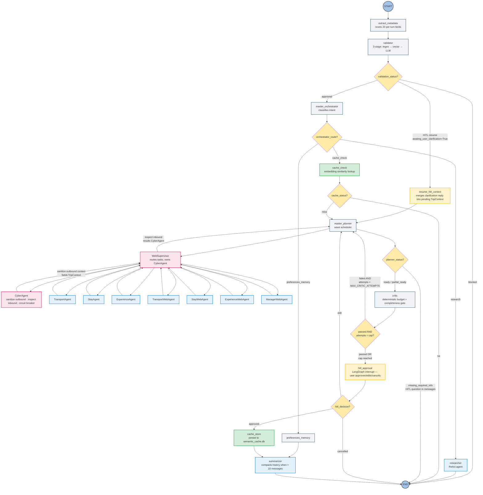

# Marco AI Travel Planner — Architectural Topology

> Visual and flow documentation for the Marco system.
> For code conventions and invariants, see CLAUDE.md. For setup, see README.md.

---

## 1. System Topology (LangGraph Architecture)

*Full routing pipeline — safety guardrails, intent dispatch, HITL checkpoint, and the WebSupervisor/CyberAgent Zero-Trust security boundary around the seven-sub-agent hierarchical async planning core.*



> **Reviewer note**: The `reviewer` agent (admin mode plan critique) is **not a graph node**. It is invoked asynchronously from `main.py` after the plan is displayed, outside the LangGraph lifecycle.

---

## 2. Async Task Dependency DAG (Master Planner Scheduling)

*Wave 1 tasks execute concurrently via `asyncio.gather` inside `WebSupervisor.dispatch()`. Wave 2 tasks execute only after their declared input dependencies have resolved.*

```mermaid
graph TD
    classDef contextStyle fill:#EDE7F6,stroke:#7B1FA2,stroke-width:1px;
    classDef sqliteTask fill:#E8F5E9,stroke:#4CAF50,stroke-width:2px;
    classDef webTask fill:#FCE4EC,stroke:#E91E63,stroke-width:2px;
    classDef calcTask fill:#FFF3E0,stroke:#FFB74D,stroke-width:2px;
    classDef finalStyle fill:#E3F2FD,stroke:#1E88E5,stroke-width:2px;
    classDef securityStyle fill:#FCE4EC,stroke:#E91E63,stroke-width:1px,stroke-dasharray:4;

    subgraph TC [TripContext Inputs]
        OA[origin_airport]:::contextStyle
        OC[origin_country]:::contextStyle
        DC[destination_city]:::contextStyle
        DD[duration_days]:::contextStyle
        TB[total_budget]:::contextStyle
        TM[travel_month]:::contextStyle
    end

    subgraph SEC [WebSupervisor + CyberAgent Security Boundary]
        CYBER_OUT[CyberAgent.sanitize_outbound\nstrips injection from TripContext fields]:::securityStyle
        CYBER_IN[CyberAgent.inspect_inbound\nredacts malicious content in results]:::securityStyle
    end

    subgraph W1S [Wave 1 · SQLite Sub-Agents]
        FF[fetch_flights]:::sqliteTask
        CV[check_visa]:::sqliteTask
        FH[fetch_hotels]:::sqliteTask
        FA[fetch_activities]:::sqliteTask
        FR[fetch_restaurants]:::sqliteTask
        FW[fetch_weather]:::sqliteTask
        EF[events_finder]:::sqliteTask
        LT[local_transport_guide]:::sqliteTask
        AT[airport_transfer_info]:::sqliteTask
    end

    subgraph W1TW [Wave 1 · TransportWebAgent]
        GL[geocode_location]:::webTask
        TLR[transport_live_research]:::webTask
    end

    subgraph W1SW [Wave 1 · StayWebAgent]
        SLR[stay_live_research]:::webTask
    end

    subgraph W1EW [Wave 1 · ExperienceWebAgent]
        LE[fetch_live_events]:::webTask
        FB[fetch_breweries]:::webTask
        EWR[experience_web_research]:::webTask
    end

    subgraph W1MW [Wave 1 · ManagerWebAgent]
        LC[live_currency_conversion]:::webTask
        CM[fetch_country_metadata]:::webTask
        WT[web_research_tavily]:::webTask
    end

    subgraph W2 [Wave 2 · Dependent Calculations]
        CTC[calculate_trip_cost]:::calcTask
    end

    TC --> CYBER_OUT
    CYBER_OUT --> W1S
    CYBER_OUT --> W1TW
    CYBER_OUT --> W1SW
    CYBER_OUT --> W1EW
    CYBER_OUT --> W1MW

    OA & DC --> FF
    OC & DC --> CV
    DC & DD --> FH
    DC --> FA
    DC --> FR
    DC & TM --> FW
    DC & TM --> EF
    DC --> LT
    DC --> AT

    DC --> GL
    DC --> TLR
    DC & DD --> SLR
    DC & TM --> LE
    DC --> FB
    DC --> EWR
    OC --> LC
    DC --> CM
    DC --> WT

    W1S --> CYBER_IN
    W1TW --> CYBER_IN
    W1SW --> CYBER_IN
    W1EW --> CYBER_IN
    W1MW --> CYBER_IN

    CYBER_IN --> W2

    FF & FH & FA & TB --> CTC

    SYNTH[Synthesize Structured Trip Plan\nplan_formatter → plan_generator → FinalPlan]:::finalStyle
    CTC & CV & GL & CM & LC --> SYNTH
```



---

## 3. Wave Scheduling Breakdown

*`planner_scheduler.py` converts the dependency DAG into ordered execution waves. The planner iterates until all tasks are either complete or blocked by persistent missing inputs.*

### Wave Classification

| Wave | Trigger | Task Count | Executed By |
|---|---|---|---|
| **Wave 1** | All required TripContext fields present | 15+ (9 SQLite + 6 PlannerTaskType web + 3 free-form web research) | `WebSupervisor.dispatch()` → `asyncio.gather` across 7 sub-agents |
| **Wave 2** | `FETCH_FLIGHTS`, `FETCH_HOTELS`, `FETCH_ACTIVITIES` all complete | 1 (`CALCULATE_TRIP_COST`) | `asyncio.gather` (single task) |

### Wave 1 Execution Layout

All Wave 1 tasks are dispatched simultaneously. Each sub-agent runs its assigned tasks independently and returns a `PlannerToolResults` object. `WebSupervisor` merges all seven after `asyncio.gather` resolves, then passes the merged dict through the full Zero-Trust inbound pipeline (URL check → Presidio PII redaction → regex inspection).

```text
WebSupervisor.dispatch()
  Step 1: CyberAgent.check_prompt_injection(TripContext fields)  ← Lakera v2 / regex fallback
  Step 2: CyberAgent.sanitize_outbound(TripContext fields)       ← regex strip, always runs
  Step 3: asyncio.gather(
      TransportAgent.run()       →  fetch_flights, check_visa
      StayAgent.run()            →  fetch_hotels
      ExperienceAgent.run()      →  fetch_activities, fetch_restaurants,
                                     local_transport_guide, fetch_weather,
                                     events_finder, airport_transfer_info
      TransportWebAgent.run()    →  geocode_location, transport_live_research
      StayWebAgent.run()         →  stay_live_research
      ExperienceWebAgent.run()   →  fetch_live_events, fetch_breweries,
                                     experience_web_research
      ManagerWebAgent.run()      →  live_currency_conversion, fetch_country_metadata,
                                     web_research_tavily
  )
  Step 4: CyberAgent.check_urls(merged URLs)                     ← Google Safe Browsing / fail-open
  Step 5: CyberAgent.redact_sensitive_data(each result)          ← Presidio local PII redaction
  Step 6: CyberAgent.inspect_inbound(merged_raw_results)         ← regex malicious-content scan
  → merged Dict[str, str]
```

Each web agent task enforces a 4-second hard timeout. On timeout or API failure the wave continues uninterrupted — the failed tool returns a structured fallback payload, and `WebSupervisor` treats it as a partial result. The `CyberAgent` circuit breaker opens after 3 consecutive failures per service and remains open for a 120-second cooldown.

### Wave 2 Execution Layout

After the Wave 1 merge, the dependency resolver re-evaluates all remaining tasks. `CALCULATE_TRIP_COST` is now unblocked because its three primary inputs have resolved:

```text
asyncio.gather(
    calculate_trip_cost(
        flight_cost   ← from FETCH_FLIGHTS result
        hotel_cost    ← from FETCH_HOTELS result × duration_days
        activity_cost ← from FETCH_ACTIVITIES result
        total_budget  ← from TripContext.total_budget
    )
)
```

### PlannerTaskType Registry — All 16 Tasks

| Task | Wave | Sub-Agent | Data Source |
|---|---|---|---|
| `FETCH_FLIGHTS` | 1 | `TransportAgent` | SQLite `flights` table |
| `CHECK_VISA` | 1 | `TransportAgent` | SQLite `visa_requirements` table |
| `FETCH_HOTELS` | 1 | `StayAgent` | SQLite `hotels` table |
| `FETCH_ACTIVITIES` | 1 | `ExperienceAgent` | SQLite `activities` table |
| `FETCH_RESTAURANTS` | 1 | `ExperienceAgent` | SQLite `restaurants` table |
| `FETCH_WEATHER` | 1 | `ExperienceAgent` | SQLite `weather` table |
| `EVENTS_FINDER` | 1 | `ExperienceAgent` | SQLite `events` table |
| `LOCAL_TRANSPORT_GUIDE` | 1 | `ExperienceAgent` | SQLite `transport` table |
| `AIRPORT_TRANSFER_INFO` | 1 | `ExperienceAgent` | SQLite `transport` table |
| `GEOCODE_LOCATION` | 1 | `TransportWebAgent` | OpenCage API |
| `FETCH_LIVE_EVENTS` | 1 | `ExperienceWebAgent` | Ticketmaster API |
| `LIVE_CURRENCY_CONVERSION` | 1 | `ManagerWebAgent` | ExchangeRate-API |
| `FETCH_BREWERIES` | 1 | `ExperienceWebAgent` | Open Brewery DB |
| `FETCH_COUNTRY_METADATA` | 1 | `ManagerWebAgent` | RestCountries API |
| `WEB_RESEARCH_TAVILY` | 1 | `ManagerWebAgent` | Tavily AI Search |
| `CALCULATE_TRIP_COST` | 2 | calc tools | Derived from Wave 1 results |

> **Note**: Three additional result keys are produced by the hierarchical web tier but are **not** `PlannerTaskType` enum members: `transport_live_research` (TransportWebAgent), `stay_live_research` (StayWebAgent), and `experience_web_research` (ExperienceWebAgent). These are free-form Tavily research keys injected directly into `planner_task_results`. `diff_changed_tasks` returns them as plain strings alongside enum `.value` strings.

> **Invariant**: every `PlannerTaskType` member must have a corresponding entry in `_TASK_REQUIREMENTS` in `planner_dependencies.py`. The dependency checker iterates all enum members at runtime; a missing entry raises `KeyError`. The dict uses `.get(task_type, ())` as a defensive fallback.

---

## 4. Conditional Edge Topology

*All routing decisions are implemented as pure functions in `src/graph/router.py`. Each function receives the current `AgentState` snapshot and returns the string name of the next node.*

### Edge: `validator` → next node

| Condition | Next Node |
|---|---|
| `validation_status != "approved"` | `END` (rejection message already in `messages`) |
| `validation_status == "approved"` AND `awaiting_user_clarification == True` | `resume_hitl_context` |
| `validation_status == "approved"` (default) | `master_orchestrator` |

### Edge: `master_orchestrator` → next node

| Condition | Next Node |
|---|---|
| `orchestrator_route == "preferences_memory"` | `preferences_memory` |
| `orchestrator_route == "research"` | `researcher` |
| `orchestrator_route == "cache_check"` (default / unknown) | `cache_check` |

### Edge: `cache_check` → next node

| Condition | Next Node |
|---|---|
| `cache_status == "hit"` | `END` (cached answer already in `messages`) |
| `cache_status == "miss"` (default) | `master_planner` |

> `force_replan=True` is honored inside the `cache_checker` itself — it returns `cache_status = "miss"` even when a high-similarity entry is found. The router only ever reads `cache_status`.

### Edge: `master_planner` → next node

| Condition | Next Node |
|---|---|
| `planner_status == "missing_required_info"` | `END` (HITL question emitted into `messages`; `awaiting_user_clarification` set to `True`) |
| `planner_status == "ready"` or `"partial_ready"` | `critic` |
| `planner_status == "timeout"` | `END` (timeout message emitted into `messages`) |

### Edge: `critic` → next node

| Condition | Next Node |
|---|---|
| `critique_result.passed == False` AND `critic_attempts < MAX_CRITIC_ATTEMPTS` | `master_planner` (auto-replan with critic suggestions injected into prompt) |
| `critique_result.passed == True` OR `critic_attempts >= MAX_CRITIC_ATTEMPTS` | `hitl_approval` |

### Edge: `hitl_approval` → next node

| Condition | Next Node |
|---|---|
| `hitl_decision == "approved"` | `cache_store` |
| `hitl_decision == "edit"` AND `hitl_edit_attempts <= MAX_HITL_EDIT_ATTEMPTS` | `master_planner` |
| `hitl_decision == "edit"` AND `hitl_edit_attempts > MAX_HITL_EDIT_ATTEMPTS` | `END` (cap message already emitted by `hitl_approval_node`) |
| `hitl_decision == "cancelled"` | `END` |

### Edge: `cache_store` → next node

| Condition | Next Node |
|---|---|
| Always | `summarizer` |

### Edge: `preferences_memory` → next node

| Condition | Next Node |
|---|---|
| Always | `summarizer` |

### Edge: `summarizer` → next node

| Condition | Next Node |
|---|---|
| Always | `END` |

> Admin-mode reviewer is called from `main.py` before returning to the REPL — it is not a graph edge.

---

## 5. State Flow Between Key Nodes

*Explicit read/write mapping for all 12 nodes. A node should only write fields listed here.*

```text
extract_metadata
    reads  → messages (last message for city/budget/modification detection)
    writes → current_city, total_budget, tool_call_count, force_replan,
             critic_attempts, hitl_decision, hitl_feedback, hitl_edit_attempts,
             orchestrator_route, orchestrator_reason,
             cache_status, cache_answer, cache_matched_query, cache_similarity_score,
             planner_status, planner_task_results, planner_structured_results,
             planner_dependency_graph, planner_scheduler_result,
             context_enrichment_status, used_web_source, final_plan

validator
    reads  → messages (last message content), awaiting_user_clarification
    writes → validation_status, messages (rejection AIMessage on block)

resume_hitl_context
    reads  → pending_trip_context, messages (for deterministic re-extraction)
    writes → trip_context, awaiting_user_clarification (→ False)

master_orchestrator
    reads  → messages, validation_status, conversation_summary
    writes → orchestrator_route, orchestrator_reason

preferences_memory
    reads  → messages
    writes → preferred_airline, food_preference, num_travelers, travel_preferences,
             messages (preference update AIMessage)

researcher
    reads  → messages, conversation_summary
    writes → messages (answer AIMessage)

cache_check
    reads  → messages, trip_context, force_replan
    writes → cache_status, cache_similarity_score, cache_matched_query, cache_answer,
             planning_query, messages (cached answer AIMessage on hit)

master_planner
    reads  → messages, cache_status, force_replan,
             preferred_airline, food_preference, num_travelers, travel_preferences,
             awaiting_user_clarification, pending_trip_context,
             pending_planner_task_results, pending_missing_fields,
             trip_context, critic_attempts, critique_result, hitl_feedback
    writes → trip_context, context_enrichment_status, planner_status,
             planner_task_results, planner_structured_results,
             planner_dependency_graph, planner_scheduler_result,
             planning_mode, used_web_source, final_plan,
             awaiting_user_clarification, pending_trip_context,
             pending_missing_fields, pending_hitl_question,
             pending_planner_task_results,
             messages (plan AIMessage or HITL question AIMessage)

critic
    reads  → messages (plan text in last AIMessage), trip_context,
             planner_structured_results, planner_task_results
    writes → critic_attempts, critique_result

hitl_approval
    reads  → critique_result, hitl_edit_attempts
    writes → hitl_decision, hitl_feedback, force_replan, hitl_edit_attempts,
             messages (cap-exceeded AIMessage when edit limit hit)

cache_store
    reads  → messages, trip_context, planner_task_results, used_web_source
    writes → (no AgentState fields — side-effect only: persists to semantic_cache.db)

summarizer
    reads  → messages, is_admin
    writes → conversation_summary
```

---

## 6. CyberAgent Security Model

*The `CyberAgent` operates at the network boundary between the planner and all external APIs. It has three independent subsystems.*

### Outbound Sanitization

Before `WebSupervisor` dispatches any sub-agent, it calls `CyberAgent.sanitize_outbound()` on the four free-text `TripContext` fields that flow into external tool calls:

| Field | Risk |
|---|---|
| `destination_city` | Prompt injection via crafted city names |
| `destination_country` | Same |
| `origin_country` | Same |
| `origin_airport` | Same |

Matches are redacted (replaced with a space) and logged at WARNING. The sanitized `TripContext` is passed to sub-agents; the original is never modified.

### Inbound Inspection

After all sub-agents return, `WebSupervisor` calls `CyberAgent.inspect_inbound()` on the merged `raw_results` dict before the planner trusts the data. Patterns detected:

| Category | Examples |
|---|---|
| Script injection | `<script>`, `<iframe>`, `javascript:`, `onerror=` |
| Code execution | `eval()`, `exec()`, `os.system()`, `subprocess.` |
| Shell commands | `; rm -rf`, `curl http`, `wget http` |
| SQL injection | `UNION SELECT`, `DROP TABLE` |
| Server-side | `<?php` |

Matches are redacted in-place as `[redacted]` and logged at WARNING.

### Circuit Breaker

Per-service failure tracking with automatic cooldown:

| Parameter | Value |
|---|---|
| Failure threshold | 3 consecutive failures → circuit opens |
| Cooldown period | 120 seconds |
| Recovery | First success after cooldown resets counter |
| Effect | `is_degraded(service)` returns `True`; callers skip live calls and use static fallback data |

Circuit state is module-level (shared across all `CyberAgent` instances in a process), protected by a `threading.Lock`.

### Optional Async External Security APIs

`CyberAgent` exposes three async methods that call external APIs when configured. All are fail-safe: missing keys or network errors fall back to a local strategy (never crash the planner).

| Method | External Service | Env Key | Fallback |
|---|---|---|---|
| `check_prompt_injection(text)` | Lakera Guard v2 — `POST /v2/guard` with `{"messages": [{"role": "user", "content": text}]}` | `LAKERA_API_KEY` | Compiled injection regex (always available) |
| `check_urls(urls)` | Google Safe Browsing v4 — `POST threatMatches:find` | `GOOGLE_SAFE_BROWSING_KEY` | Empty list (fail-open — never block legitimate content) |
| `redact_sensitive_data(text)` | Microsoft Presidio (local spaCy model) — no API key | *(none — local)* | Original text unmodified when spaCy model not installed |

`check_prompt_injection` and `check_urls` are called from `WebSupervisor.dispatch()` (steps 1 and 4) and from `researcher.py` around the ReAct loop. `redact_sensitive_data` is called on every merged result string before the regex inspection pass (step 5).
